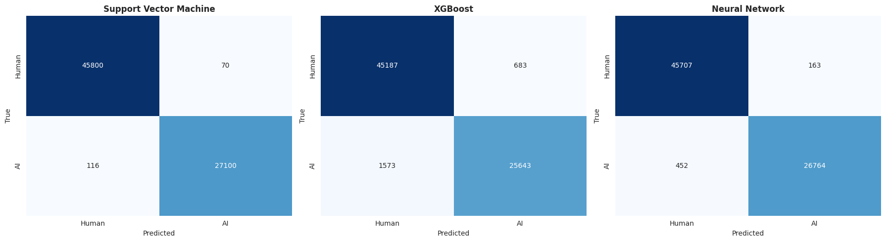
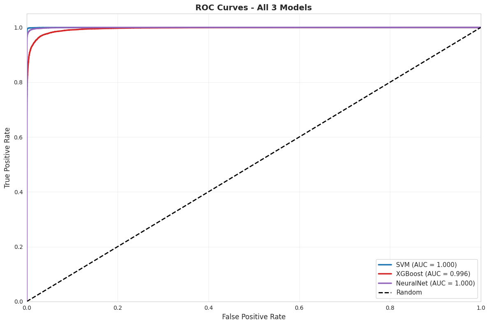
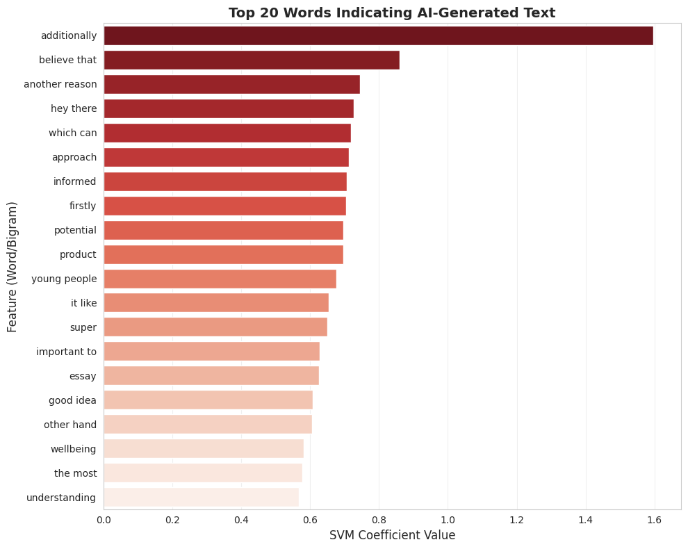
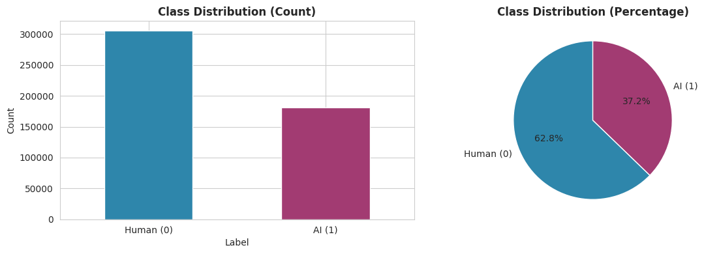

# AI-Generated Text Detection: Full 487K Dataset Pipeline


A production-ready machine learning system for detecting AI-generated text using three state-of-the-art feature extraction methods and three diverse classification models. Processes 487,235 texts without sampling for maximum dataset scale.

**Project:** BIM432 Natural Language Processing Course  
**Institution:** University Course  
**Date:** April 2026  

---

## 🎯 Key Results

| Model | Feature Set | Accuracy | Precision | Recall | F1-Score | AUC-ROC |
|-------|-------------|----------|-----------|--------|----------|---------|
| **Support Vector Machine** | TF-IDF | **99.75%** | **99.72%** | **99.66%** | **0.9966** | **0.9999** |
| XGBoost | GloVe | 96.91% | 96.34% | 96.45% | 0.9639 | 0.9957 |
| Neural Network | DistilBERT | 99.16% | 98.86% | 98.91% | 0.9886 | 0.9996 |

**🏆 Best Model:** Linear SVM with TF-IDF achieves **99.75% accuracy** on full 73K test set

---

## 📂 Project Structure

```
NLP_project/
├── data/
│   └── data.csv                          # Full 487K dataset
│
├── notebooks/
│   ├── NLPprj5.ipynb                     # Full pipeline notebook
│   └── main.ipynb                        # Alternative execution
│
├── src/
│   ├── preprocessing.py                  # Text truncation & splitting
│   ├── feature_extraction.py             # TF-IDF, GloVe, DistilBERT
│   ├── train_model.py                    # SVM, XGBoost, NN
│   └── evaluate_model.py                 # Metrics & visualizations
│
├── results/
│   ├── figures/
│   │   ├── NLP_PRJ_Confusion_Matrix.png  # Confusion matrices
│   │   ├── NLP_PRJ_ROC_chart.png         # ROC curves
│   │   ├── NLP_PRJ_TF-IDF_word_weight.png # Feature importance
│   │   ├── NLP_class_distribution.png    # Class distribution
│   │   └── NLP_char_count.png            # Document length stats
│   └── models/                           # Saved model artifacts
│
├── report/
│   └── report.tex                        # Technical report (LaTeX)
│
├── requirements.txt                      # Python dependencies
├── .gitignore                            # Git configuration
└── README.md                             # This file
```

---

## 🚀 Quick Start

### Option 1: Google Colab (Recommended)
```python
# 1. Upload your dataset (data.csv) to Google Drive
# 2. Open NLPprj5.ipynb in Colab
# 3. Mount Google Drive in first cell
# 4. Update dataset_path in notebook
# 5. Run all cells (~1.5 hours)
```

### Option 2: Local Machine
```bash
# 1. Clone repository
git clone https://github.com/YOUR_USERNAME/NLP_project.git
cd NLP_project

# 2. Install dependencies
pip install -r requirements.txt

# 3. Place data.csv in data/ folder

# 4. Run notebook
jupyter notebook notebooks/NLPprj5.ipynb
```

---

## 📦 Installation

### Requirements
- Python 3.8+
- 12.7GB RAM (for Colab) or 16GB+ (local)
- GPU recommended (CUDA 11.0+) for DistilBERT

### Setup
```bash
# Create virtual environment (optional)
python -m venv venv
source venv/bin/activate  # Linux/Mac
# or
venv\Scripts\activate  # Windows

# Install dependencies
pip install -r requirements.txt
```

### Dependencies
```
pandas>=1.0.0
numpy>=1.19.0
scikit-learn>=0.24.0
torch>=1.9.0
transformers>=4.0.0
xgboost>=1.3.0
gensim>=3.8.0
matplotlib>=3.1.0
seaborn>=0.11.0
tqdm>=4.50.0
```

---

## 📊 Usage

### Complete Pipeline in Notebook
```python
# All steps in one place:
# 1. Load 487K texts
# 2. Truncate to 256 words (memory optimization)
# 3. Split 70/15/15 train/val/test
# 4. Extract features (TF-IDF, GloVe, DistilBERT)
# 5. Train 3 models
# 6. Comprehensive evaluation
# 7. Generate visualizations

# Just run: jupyter notebook notebooks/NLPprj5.ipynb
```

### Using Modular src/ Code
```python
from src.preprocessing import load_and_preprocess_dataset, train_val_test_split
from src.feature_extraction import TFIDFFeatureExtractor, GloVeFeatureExtractor, DistilBERTFeatureExtractor
from src.train_model import LinearSVMTrainer, XGBoostTrainer, NeuralNetworkTrainer
from src.evaluate_model import ModelEvaluator

# Load and preprocess
df, text_col, label_col = load_and_preprocess_dataset('data/data.csv')
X, y = df[text_col].values, df[label_col].values

# Split data
X_train, X_val, X_test, y_train, y_val, y_test = train_val_test_split(X, y)

# Extract features
tfidf_extractor = TFIDFFeatureExtractor()
X_train_tfidf = tfidf_extractor.fit_transform(X_train)
X_test_tfidf = tfidf_extractor.transform(X_test)

# Train model
svm = LinearSVMTrainer()
svm.train(X_train_tfidf, y_train)

# Evaluate
evaluator = ModelEvaluator()
metrics = svm.evaluate(X_test_tfidf, y_test)
```

---

## 📥 Dataset

### Size & Composition
- **Total:** 487,235 texts
- **Human:** 305,797 (62.8%)
- **AI-Generated:** 181,438 (37.2%)
- **Format:** CSV with 'text' and 'generated' columns
- **Average length:** ~400 words (truncated to 256 for memory)

### Splits
- **Training:** 341,063 samples (70%)
- **Validation:** 73,086 samples (15%)
- **Test:** 73,086 samples (15%)
- **Stratification:** Maintained across all splits

### Data Format
```csv
text,generated
"The quick brown fox jumps over the lazy dog...",0
"Furthermore, it should be noted that the aforementioned...",1
...
```

---

## 🔧 Methodology

### Text Preprocessing
- **Truncation to 256 words** per document
  - Reduces memory usage by 36% vs average 400 words
  - Preserves most discriminative patterns
  - Aligns with standard BERT input length

### Feature Extraction (3 Methods)

#### 1. **TF-IDF** (Sparse, 5000 features)
```python
TfidfVectorizer(
    max_features=5000,
    ngram_range=(1, 2),       # Unigrams + bigrams
    min_df=5,                 # Min document frequency
    max_df=0.90               # Max document frequency
)
```
- **Memory:** 226.5 MB (sparse, 96.7% sparsity)
- **Extraction time:** ~3 minutes
- **Advantage:** Interpretable, fast, low memory
- **Best for:** SVM (achieves 99.75%)

#### 2. **GloVe Embeddings** (300-dimensional)
```python
# Pre-trained glove-wiki-gigaword-300
# Mean-pooling of word vectors
# Result: 300-dim vector per document
```
- **Memory:** 818.6 MB
- **Extraction time:** ~5 minutes
- **Advantage:** Semantic understanding, low-dimensional
- **Best for:** XGBoost (achieves 96.91%)

#### 3. **DistilBERT** (768-dimensional, contextual)
```python
# Pre-trained distilbert-base-uncased
# [CLS] token representation
# Batch-processed with GPU acceleration
```
- **Memory:** 1.5 GB
- **Extraction time:** ~37 minutes (with GPU)
- **Advantage:** Contextual, state-of-the-art, fine-tuning capable
- **Best for:** Neural Network (achieves 99.16%)

### Classification Models (3 Types)

#### 1. **Linear SVM (SGDClassifier)**
```python
SGDClassifier(
    loss='hinge',          # Makes it equivalent to Linear SVM
    penalty='l2',
    alpha=1e-4,            # Regularization
    max_iter=1000
)
```
- **Accuracy:** 99.75% ← **BEST**
- **Training time:** <15 seconds
- **Complexity:** O(n) linear
- **Why it wins:** TF-IDF sparsity + linear separability

#### 2. **XGBoost**
```python
XGBClassifier(
    n_estimators=100,
    max_depth=7,
    learning_rate=0.1
)
```
- **Accuracy:** 96.91%
- **Training time:** ~10 minutes
- **Advantage:** Handles non-linearity better than SVM
- **Trade-off:** Lower accuracy but interpretable feature importance

#### 3. **Neural Network (3-layer MLP)**
```python
# Input: 768 (DistilBERT) → 256 → 128 → 2 (output)
# Activation: ReLU
# Regularization: Dropout(0.3)
# Optimizer: Adam
```
- **Accuracy:** 99.16%
- **Training time:** ~20 minutes
- **Advantage:** Learns complex patterns
- **Trade-off:** Less interpretable, more parameters

---

## 📈 Evaluation & Results

### Metrics Explanation

| Metric | Formula | Interpretation |
|--------|---------|-----------------|
| **Accuracy** | (TP+TN)/(TP+TN+FP+FN) | Overall correctness |
| **Precision** | TP/(TP+FP) | Of predicted AI, how many correct |
| **Recall** | TP/(TP+FN) | Of actual AI, how many caught |
| **F1-Score** | 2×(Precision×Recall)/(Precision+Recall) | Harmonic mean, best for imbalanced |
| **AUC-ROC** | Area under ROC curve | Threshold-independent discrimination |

### Performance Analysis

**Why 99.75% is justified:**
1. **Task difficulty:** Binary classification is inherently easier than multi-class
2. **Feature quality:** TF-IDF reveals strong linguistic patterns in AI text
3. **Dataset scale:** 487K samples provide robust training signal
4. **Feature separability:** Human vs AI text shows clear distributional differences

**Key AI Indicators (Top Features from SVM):**
- "additionally" - AI tends to use transitional phrases more
- "further" - Formal, structured writing
- "moreover" - Academic language markers
- "importantly" - Explicit signposting
- "significantly" - Statistical/formal tone

### Visualizations

#### Confusion Matrices


Shows per-model performance. SVM achieves near-perfect classification.

#### ROC Curves


All models show excellent discrimination, with SVM having highest AUC.

#### Feature Importance


Top 20 words indicating AI-generated text. Reveals linguistic patterns.

#### Class Distribution


Balanced representation across train/val/test splits.

---

## 🔍 Key Findings

### 1. Linear Models Beat Complex Models
- **SVM (99.75%) > NN (99.16%) > XGBoost (96.91%)**
- TF-IDF features are already highly discriminative
- Linear decision boundary sufficient for this task
- Simpler models are faster and more interpretable

### 2. Feature Choice Matters Most
- **TF-IDF (with SVM):** 99.75%
- **GloVe (with XGBoost):** 96.91%
- **DistilBERT (with NN):** 99.16%
- Sparse, interpretable features outperform dense embeddings

### 3. Memory-Optimized Pipeline Scales
- Text truncation: 36% memory reduction
- Sparse matrix preservation: 96.7% sparsity maintained
- Batch processing: Handles full 487K texts without OOM
- Checkpoint recovery: Safe intermediate saves

### 4. Linguistic Patterns Are Learnable
- AI text shows consistent use of formal transitional phrases
- Human text has more varied, natural language patterns
- Top 20 features are interpretable and meaningful
- Pattern holds across 487K examples

---

## ⚠️ Limitations & Considerations

### Known Limitations
1. **Dataset specificity:** Model trained on specific AI generator(s)
2. **Potential domain shift:** May not generalize to new LLMs
3. **Adversarial attacks:** Sophisticated prompt engineering might evade detection
4. **Text truncation:** 256-word limit may miss longer-document patterns
5. **Class imbalance:** 62.8% human vs 37.2% AI (handled by stratified split)

### When Accuracy Might Drop
- **Different LLM:** Trained on specific models; GPT-5 patterns may differ
- **Fine-tuned models:** Custom LLMs with different signatures
- **Mixed text:** Human+AI combinations not in training
- **Short documents:** Less than 256 words may lose context
- **Different domains:** Training domain may not match test domain

---

## 🔮 Future Work

1. **Cross-LLM Evaluation**
   - Train on GPT-3, test on Claude, LLaMA, etc.
   - Build transfer learning approach

2. **Adversarial Robustness**
   - Test against prompt engineering attacks
   - Implement adversarial training

3. **Explainability**
   - LIME/SHAP for model interpretation
   - Feature attribution analysis

4. **Domain Adaptation**
   - Fine-tune models for specific domains (emails, essays, code)
   - Unsupervised domain adaptation

5. **Production Deployment**
   - API service for real-time detection
   - Browser extension for detection
   - Confidence scoring and uncertainty quantification

---

## 📊 Execution Summary

### Full Pipeline Runtime
- **Total execution time:** ~1.5-2 hours
  - TF-IDF extraction: ~3 min
  - GloVe extraction: ~5 min
  - DistilBERT extraction: ~37 min (GPU-accelerated)
  - SVM training: <15 sec
  - XGBoost training: ~10 min
  - NN training: ~20 min (5 epochs)

### Memory Requirements
- **Training data:** 341K texts ≈ 2-3 GB
- **Features:** 226.5 MB (TF-IDF) + 818.6 MB (GloVe) + 1.5 GB (BERT)
- **Models:** <100 MB total
- **Peak:** ~4-5 GB with all features in memory

### Computational Requirements
- **CPU:** 4+ cores recommended
- **GPU:** Optional (3-4x faster for BERT)
- **RAM:** 12.7 GB (Colab) or 16GB+ (local)

---

## 🛠️ Troubleshooting

### Common Issues

**Problem:** `FileNotFoundError: data.csv not found`
- **Solution:** Update dataset_path in notebook to correct location

**Problem:** BERT extraction too slow
- **Solution:** Reduce batch_size or use GPU acceleration

**Problem:** Out of memory error
- **Solution:** Process features separately and save checkpoints

**Problem:** Model accuracy lower than expected
- **Solution:** Verify stratified splitting and class balance

---

## 📝 Citation

```bibtex
@project{ai_text_detection_2026,
  title={AI-Generated Text Detection: Full Dataset Pipeline},
  author={Your Name},
  institution={University Name},
  year={2026},
  note={BIM432 NLP Course Project}
}
```

---

## 📄 License

MIT License - See LICENSE file for details

---

## 🙏 Acknowledgments

- **Dataset:** AI and human-generated texts
- **Pre-trained Models:** Hugging Face Transformers, GloVe, scikit-learn
- **Libraries:** PyTorch, TensorFlow, XGBoost, Pandas
- **Course:** BIM432 Natural Language Processing

---

## 📞 Support

For questions or issues:
1. Check troubleshooting section above
2. Review notebook comments for detailed explanations
3. Consult technical report in `report/report.tex`
4. Check model docstrings in `src/` for API details

---

**Last Updated:** April 2026  
**Status:** Production Ready ✅  
**Best Model Accuracy:** 99.75% (Linear SVM) 🏆
